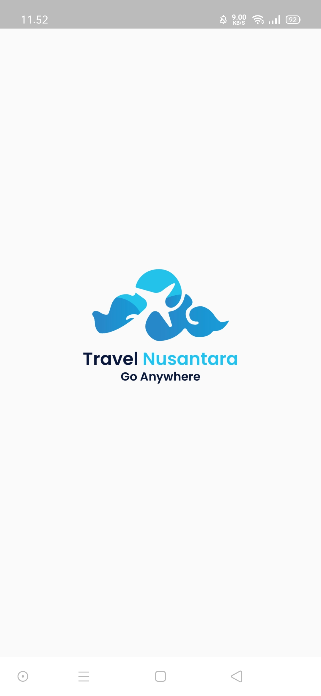
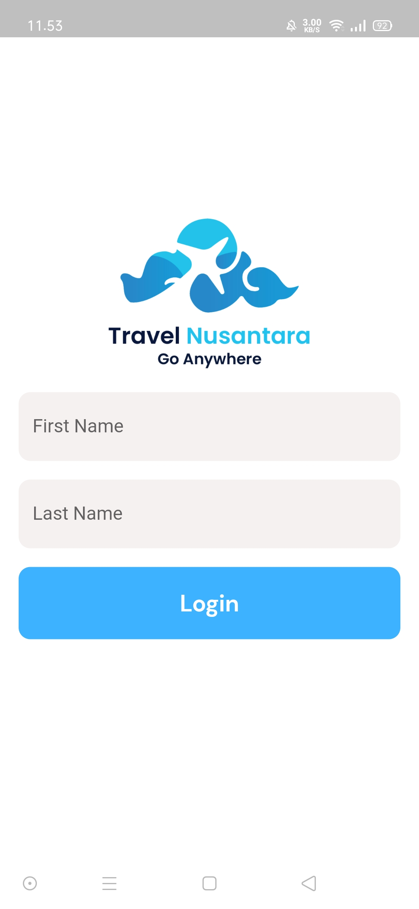
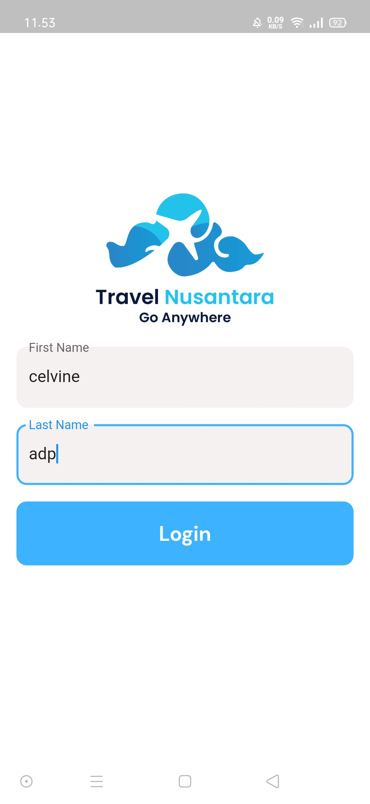
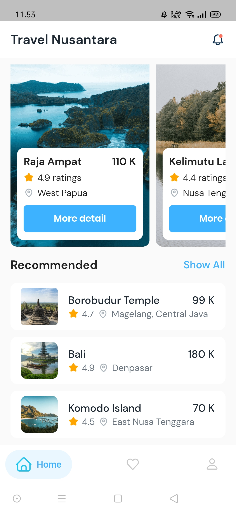
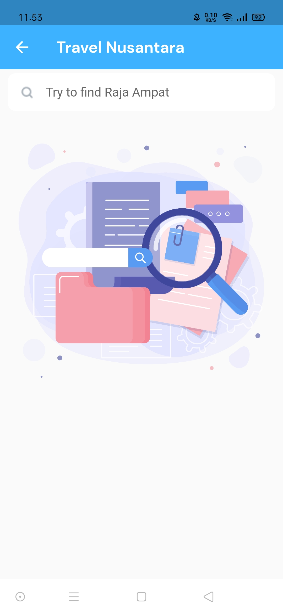
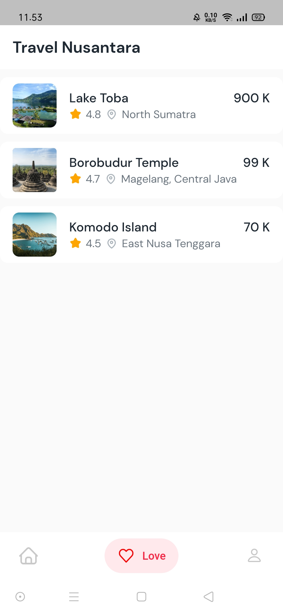

# Travel Nusantara

Dicoding Submission 1
<h1>Belajar Membuat Aplikasi Flutter untuk Pemula</h1>
<h2>1. Informasi Submission</h2>

<h2>2. Tampilan Aplikasi</h2>

    
    
    
    
    
    
    
    
    
    
    

<h2>3. Informasi kelas</h2>
<b>Materi yang dipelajari:</b>
<ul>
    <li>Pengenalan Flutter : Mengenal tentang Flutter dan instalasi alat-alat yang dibutuhkan untuk pengembangan. (4 jam 50 menit)</li>
    <li>Dasar-Dasar Flutter : Mempelajari dasar-dasar dalam membuat aplikasi Flutter dan pengenalan tentang package manager. (1 jam 45 menit)</li>
    <li>Pengenalan Widget : Mengenal widget-widget dasar yang umum digunakan dalam Flutter, navigasi antar halaman, dan bagaimana menambahkan aset serta gambar. (16 jam 40 menit)</li>
    <li>Deployment : Mampu melakukan build aplikasi Flutter ke dalam bentuk berkas APK, AAB, dan folder web. (1 jam 45 menit)</li>
</ul>
 
<b>Evaluasi Pembelajaran:</b>

Submission (proyek akhir) berupa sebuah aplikasi Flutter sederhana dengan tema bebas.